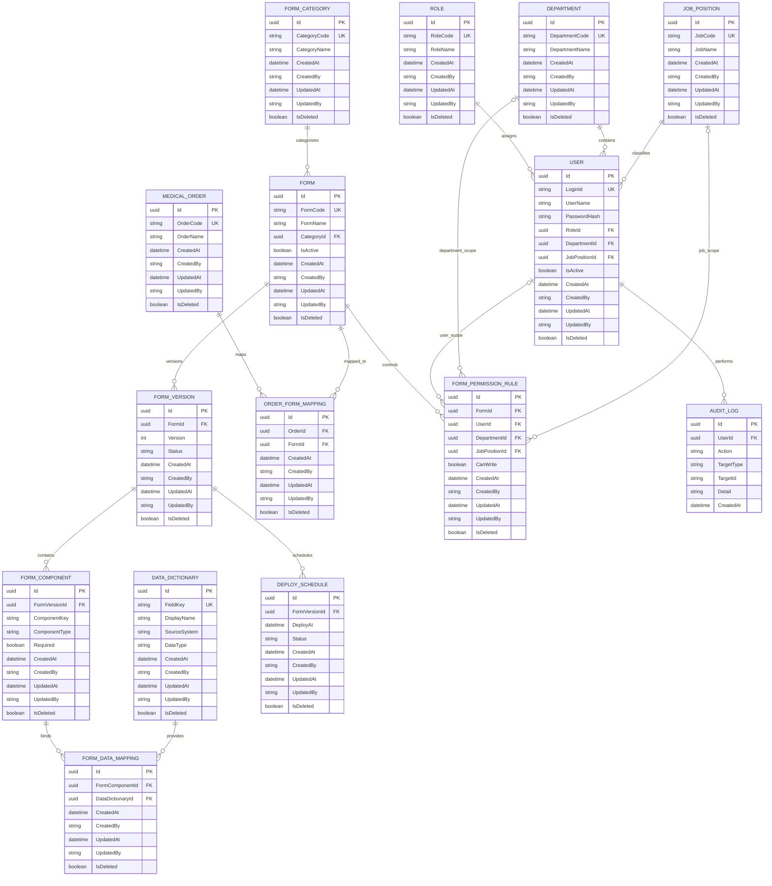

# MediForm Manager — ERD V1

**Last Reviewed:** 2026-08-11

> Enterprise Medical Form Lifecycle Management Platform  
> Database: PostgreSQL  
> ORM: Entity Framework Core  
> Primary key strategy: UUID (`Guid`)

---

## 1. Scope

This ERD defines the first version of the MediForm Manager data model.

It covers:

- User and organization management
- Role-based access foundations
- Medical form lifecycle management
- Form version and component management
- Medical order-to-form mapping
- Future-ready permission and deployment structures

The MVP implementation may begin with the core entities first, while the remaining entities can be added incrementally through EF Core migrations.

---

## 2. ERD Diagram

---

## 3. Core Entity Groups

### 3.1 Identity and Organization

- `User`
- `Role`
- `Department`
- `JobPosition`

These entities define who can access the system and the organizational context in which users work.

### 3.2 Form Lifecycle

- `FormCategory`
- `Form`
- `FormVersion`
- `FormComponent`

These entities model the lifecycle of medical forms from logical form code to version-specific components.

### 3.3 Clinical Integration

- `MedicalOrder`
- `OrderFormMapping`

These entities support automatic mapping from OCS/EMR order codes to applicable medical forms.

### 3.4 Authorization

- `FormPermissionRule`

This entity supports write permission by user, department, or job position.

At least one of the following scope columns should be populated:

- `UserId`
- `DepartmentId`
- `JobPositionId`

### 3.5 Data Mapping

- `DataDictionary`
- `FormDataMapping`

These entities prepare the platform for future drag-and-drop binding between form components and OCS/EMR data fields.

### 3.6 Deployment and Auditing

- `DeploySchedule`
- `AuditLog`

These entities support scheduled deployment and traceability.

---

## 4. Main Relationships

| Parent | Child | Cardinality | Description |
|---|---|---:|---|
| Role | User | 1:N | One role can be assigned to multiple users. |
| Department | User | 1:N | One department can contain multiple users. |
| JobPosition | User | 1:N | One job position can be assigned to multiple users. |
| FormCategory | Form | 1:N | One category can contain multiple forms. |
| Form | FormVersion | 1:N | One form can have multiple versions. |
| FormVersion | FormComponent | 1:N | One version can contain multiple components. |
| MedicalOrder | OrderFormMapping | 1:N | One order can map to multiple forms. |
| Form | OrderFormMapping | 1:N | One form can be mapped from multiple orders. |
| Form | FormPermissionRule | 1:N | One form can have multiple permission rules. |
| FormComponent | FormDataMapping | 1:N | One component can have multiple data mappings. |
| DataDictionary | FormDataMapping | 1:N | One data field can be reused across multiple components. |
| FormVersion | DeploySchedule | 1:N | One version may have multiple deployment schedules or deployment records. |
| User | AuditLog | 1:N | One user can create multiple audit log entries. |

---

## 5. Key Constraints

Recommended unique constraints:

- `Role.RoleCode`
- `Department.DepartmentCode`
- `JobPosition.JobCode`
- `User.LoginId`
- `FormCategory.CategoryCode`
- `Form.FormCode`
- `MedicalOrder.OrderCode`
- `DataDictionary.FieldKey`
- `(FormVersion.FormId, FormVersion.Version)`
- `(OrderFormMapping.OrderId, OrderFormMapping.FormId)`
- `(FormDataMapping.FormComponentId, FormDataMapping.DataDictionaryId)`

Recommended indexes:

- `User.RoleId`
- `User.DepartmentId`
- `User.JobPositionId`
- `Form.CategoryId`
- `FormVersion.FormId`
- `FormComponent.FormVersionId`
- `OrderFormMapping.OrderId`
- `OrderFormMapping.FormId`
- `FormPermissionRule.FormId`
- `DeploySchedule.DeployAt`
- `AuditLog.UserId`
- `AuditLog.CreatedAt`

---

## 6. Implementation Order

Recommended EF Core implementation order:

1. `Role`
2. `Department`
3. `JobPosition`
4. `User`
5. `FormCategory`
6. `Form`
7. `FormVersion`
8. `FormComponent`
9. `MedicalOrder`
10. `OrderFormMapping`
11. `FormPermissionRule`
12. `DataDictionary`
13. `FormDataMapping`
14. `DeploySchedule`
15. `AuditLog`

---

## 7. MVP Boundary

### Included in the first implementation phase

- User
- Role
- Department
- JobPosition
- FormCategory
- Form
- FormVersion
- FormComponent
- MedicalOrder
- OrderFormMapping

### Planned after the first CRUD and authentication flow

- FormPermissionRule
- DataDictionary
- FormDataMapping
- DeploySchedule
- AuditLog

---

## 8. Notes

- `BaseEntity` is not a database table by itself. It supplies common properties to derived entities.
- UUID primary keys are used to support distributed environments and reduce key collision risk.
- Soft deletion is supported through `IsDeleted`.
- `User.IsActive` controls whether a retained user account can currently authenticate; it is distinct from `IsDeleted`.
- Entity Framework Core migrations are the source of truth for physical database changes.
- The Domain project should remain independent from EF Core-specific implementation details.
